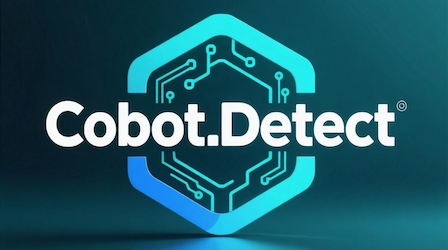
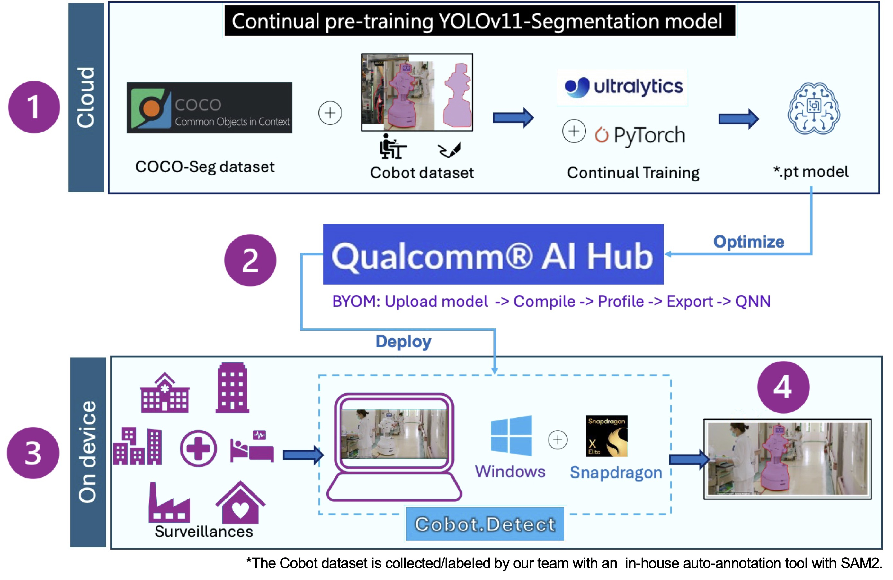

---

# Cobot.Detect
Cobot.Detect project, aiming to provide comprehensive monitoring for collaborative robot (cobot) work areas through an on-device privacy-centric visual AI solution.

### 🏗️ Workflow Steps

<!--
 -->

1. **Continual Training**  
   Utilize both the COCO-Seg and Cobot datasets to perform continual training of the model.

2. **Model Optimization**  
   Optimize the trained model using [Qualcomm AI Hub](https://aihub.qualcomm.com/).

3. **Device Deployment**  
   Deploy the optimized model to devices running Windows and powered by Snapdragon processors.

4. **On-Device Data Privacy**  
   By keeping data on-device, Cobot.Detect seamlessly integrates with cobot applications, safeguarding trade secrets and the privacy of people captured in the monitored environment..

   

* * *
# 🗂️ Cobot Dataset Generation

  

- **Auto Annotation Overview**
  
  [Annotation UI](https://github.com/user-attachments/assets/1345436b-0d57-4b72-9e9d-fe161b5efe08)

> 🚀 **Full End-to-End Dataset Generation and Model Training Demo**  
> This section references the [`End2End_demo`](https://github.com/vscv/NaiveSAM/tree/main/files/End2End_demo) from our in-house auto-annotation tool
[@vscv/NaiveSAM](https://github.com/vscv/NaiveSAM) repository.  
> Check out the IPython notebook directly!

<!--
### ✨ About This Section

- All steps, sample codes, and workflow diagrams in this section are from [NaiveSAM/End2End_demo](https://github.com/vscv/NaiveSAM/tree/main/files/End2End_demo).
- For more technical details, code, and extended applications, please refer to the original project.

---

> 💡 **TIP:**  
> To quickly copy, run, or customize this workflow, please check the `End2End_demo` directory in the [NaiveSAM repository](https://github.com/vscv/NaiveSAM).
-->

* * *

# 🔬 Model Compilation Test on Snapdragon X Elite

Table 1 shows the results of compiling “yolo-v[11,8]n.pt” with different target models for the Snapdragon X Elite CRD.

| Model/Format           | YOLOv11n-seg | YOLOv8n-seg |            Runtime                   |              link            |
|------------------------|:------------:|:------------:|:-------------------------------:|:---------------------------|
| **onnx**               | ✅ 31.7ms 133MB CPU304| ✅7.1ms 17MB NU337|   	ONNX Runtime | |
| **tflite**             | ❌[1]| ❌[1]       |                                                           |
| **qnn_context_binary** | ❌[2]            | ✅5.5ms 5MB NPU336                       | QNN API | [details](https://app.aihub.qualcomm.com/jobs/jpew8mj1p/) |
| **precompiled_qnn_onnx** | ❌[2]         | ✅5.4ms 17MB NPU331                       | ONNX Runtime | [details](https://app.aihub.qualcomm.com/jobs/jpvrek1z5/) |
| **qnn_dlc**            | ✅ 5.4ms 5MB NPU415            | ✅5.0ms 20MB NPU326                 |  QNN API | [details](https://app.aihub.qualcomm.com/jobs/jg9yknvl5/) |

`QNN API/Backend/SDK needs to run within Ubuntu 20.04`  [• You have an Ubuntu 20.04 or WSL2 on Windows with an Ubuntu 20.04 development environment.](https://www.qualcomm.com/developer/software/neural-processing-sdk-for-ai)

<!-- not goood and less clear...
Based on the data in this table and the environmental constraints of the QNN API, choosing YOLOv8 together with precompiled_qnn_onnx may be the conservative but easy-to-implement choice. However, we will insist on using the newer v11 model for further challenges.
-->
For performance evaluation and specification selection, we conducted real-device tests across different configurations using the Qualcomm AI HUB. Based on the data in this table and the environmental constraints of the QNN API, choosing YOLOv8 together with precompiled_qnn_onnx may be the conservative but easy-to-implement choice. However, we will continue to challenge ourselves by insisting on using the newer v11 model to explore its potential benefits further.

###### [1] ❌ FAILED   TargetRuntime.TFLITE is not a supported target for Snapdragon X Elite CRD.</small>
###### [2] ❌ FAILED   Model compile failed due to an internal error.

---
# 📦 BYOM

---
# 💻 Case study

---
